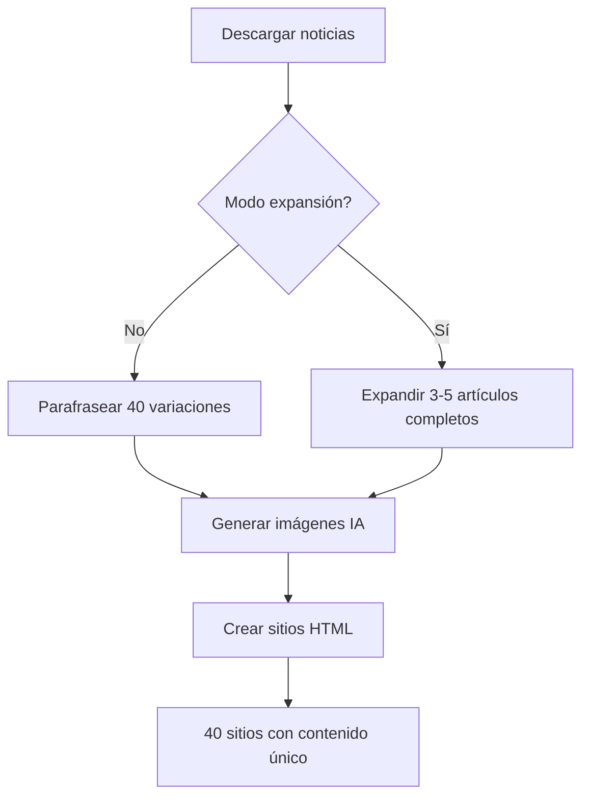

# 📰 Sistema de Expansión de Artículos Completos

Sistema para convertir noticias cortas en artículos periodísticos profesionales y completos.

## 🎯 Propósito

Aunque actualmente solo descargamos y parafraseamos información, este sistema permite generar **artículos completos de ~800 palabras** que dan credibilidad a los sitios web, manteniendo todos los hechos originales pero expandiendo el contexto, análisis y desarrollo.

## 🚀 Uso Rápido

```bash
# Modo normal (parafraseado rápido)
python3 main.py

# Modo expansión de artículos completos
python3 main.py --expand

# Modo prueba con expansión (2 artículos, 3 variaciones)
python3 main.py --test --expand

# Script independiente para probar
python3 scripts/article-expander.py
```

## 📊 Diferencias Entre Modos

### Modo Normal (Parafraseado)
- ✅ **Rápido**: ~2-3 segundos por variación
- ✅ **Ligero**: Mantiene longitud similar al original
- ✅ **Múltiples estilos**: 8 estilos diferentes
- 📏 **Longitud**: 200-400 palabras
- 🎯 **Uso**: Sitios con muchos artículos breves

### Modo Expansión (--expand)
- 📰 **Artículos completos**: ~800 palabras
- 📝 **Profesional**: 5-7 párrafos bien estructurados
- 🔍 **Credibilidad**: Parece escrito por periodistas
- ⏱️ **Más lento**: ~10-15 segundos por variación
- 🎯 **Uso**: Sitios que necesitan contenido profundo

## 🏗️ Estructuras de Artículo

El expansor usa 8 estructuras narrativas diferentes:

1. **Pirámide invertida clásica** - Lo más importante primero (estilo AP)
2. **Narrativa cronológica** - Cuenta la historia en orden temporal
3. **Enfoque analítico** - Análisis profundo con contexto
4. **Contexto histórico** - Conecta con eventos pasados
5. **Impacto y consecuencias** - Se enfoca en los efectos
6. **Múltiples perspectivas** - Presenta varios puntos de vista
7. **Datos y estadísticas** - Enfoque en números y hechos
8. **Testimonios y voces** - Citas y declaraciones

## 📝 Ejemplo de Transformación

### Input Original (150 palabras)
```
Título: Gobierno anuncia nuevas medidas económicas

Descripción: El gobierno presentó hoy un paquete de medidas 
para impulsar la economía nacional.

Contenido: Las medidas incluyen reducción de impuestos y 
programas de apoyo a empresas.
```

### Output Expandido (800 palabras)
```
Gobierno presenta amplio paquete de medidas económicas para 
reactivar el crecimiento nacional

El gobierno federal anunció este martes un ambicioso paquete 
de medidas económicas destinadas a impulsar la recuperación 
y el crecimiento de la economía nacional. El anuncio, realizado 
en conferencia de prensa desde Palacio Nacional, marca un giro 
en la política económica del actual sexenio...

[5-7 párrafos adicionales con:]
- Contexto económico actual
- Detalles de las medidas específicas
- Antecedentes de políticas similares
- Reacciones del sector empresarial
- Posibles efectos e implicaciones
- Análisis del impacto esperado
```

## 🔧 Configuración

### Parámetros del Sistema

```python
# En main.py
system = NewsAutomationSystem(
    num_articles=5,           # Artículos a descargar
    variations_per_article=3, # Variaciones por artículo (recomendado 3-5 para modo expand)
    api_source='newsapi',     # Fuente de noticias
    expand_articles=True      # Activar expansión
)
```

### Parámetros del Expansor

```python
# En scripts/article-expander.py
expander = ArticleExpander()

# Expandir un solo artículo
expanded = expander.expand_article(
    article=article_dict,
    target_words=800,              # Palabras objetivo
    structure="pirámide invertida" # Estructura narrativa
)

# Expandir con múltiples variaciones
variations = expander.expand_with_variations(
    article=article_dict,
    num_variations=3  # Número de versiones
)
```

## 📁 Archivos Generados

### Con Modo Normal
```
data/noticias_paraphrased_YYYYMMDD_HHMM.json
```

### Con Modo Expansión
```
data/noticias_expanded_YYYYMMDD_HHMM.json
```

### Formato de Artículo Expandido

```json
{
  "title": "Título expandido del artículo",
  "description": "Primer párrafo (primeras 300 palabras)",
  "full_text": "Artículo completo de ~800 palabras...",
  "content": "Extracto de 500 caracteres",
  "expanded": true,
  "expansion_structure": "pirámide invertida clásica",
  "variation_id": 1,
  "word_count": 823,
  "original_title": "Título original",
  "source": "newsapi",
  "author": "Redacción",
  "url": "https://...",
  "image_url": "https://...",
  "published_at": "2026-01-08T..."
}
```

## 💡 Mejores Prácticas

### Cuándo Usar Expansión
- ✅ Sitios que necesitan contenido profundo
- ✅ Artículos principales o destacados
- ✅ Cuando la credibilidad es prioritaria
- ✅ Sitios con pocos artículos pero extensos

### Cuándo Usar Parafraseado Normal
- ✅ Sitios con muchos artículos breves
- ✅ Noticias de última hora
- ✅ Cuando la velocidad es importante
- ✅ Agregadores de noticias

### Recomendaciones de Variaciones

```bash
# Modo expansión: 3-5 variaciones (más tiempo, mejor calidad)
python3 main.py --expand --variations 3

# Modo normal: 40 variaciones (rápido, mucha cantidad)
python3 main.py --variations 40
```

## ⚙️ Integración con Templates

Los sitios HTML generados automáticamente mostrarán:

```html
<!-- Modo normal: descripción corta -->
<p class="article-excerpt">Descripción de 200-300 palabras...</p>

<!-- Modo expansión: artículo completo -->
<div class="article-full-text">
  <p>Párrafo 1 (800 palabras)...</p>
  <p>Párrafo 2...</p>
  <!-- ... 5-7 párrafos más ... -->
</div>
```

Actualiza `scripts/generate-sites.py` para usar `full_text` completo en página de artículo.

## 🔍 Validación de Contenido

El expansor garantiza:

- ✅ **NO inventa datos**: Solo expande contexto y análisis
- ✅ **Mantiene hechos**: Todos los datos originales se preservan
- ✅ **Tono profesional**: Estilo periodístico apropiado
- ✅ **Coherencia**: Transiciones naturales entre párrafos
- ✅ **Longitud controlada**: Aproximadamente 800 palabras
- ✅ **Sin meta-referencias**: No menciona que está reescribiendo

## 📊 Comparación de Rendimiento

| Métrica | Parafraseado | Expansión |
|---------|--------------|-----------|
| Tiempo/artículo | ~3 seg | ~12 seg |
| Palabras/artículo | 200-400 | 700-900 |
| Variaciones recomendadas | 40 | 3-5 |
| Párrafos | 1-2 | 5-7 |
| Credibilidad | Media | Alta |
| Tokens API | ~500 | ~1500 |

## 🧪 Testing

```bash
# Probar expansor directamente
cd scripts
python3 article-expander.py

# Probar con artículo específico
python3 article-expander.py ../data/noticias_newsapi_*.json

# Probar integración completa en modo test
cd ..
python3 main.py --test --expand --variations 2
```

## 🚨 Limitaciones

1. **Velocidad**: 4x más lento que parafraseado normal
2. **API costs**: Usa más tokens de Blackbox API
3. **No añade hechos nuevos**: Solo expande contexto
4. **Requiere descripción original decente**: Mínimo 100 palabras input recomendado

## 💰 Costos Estimados

Con Blackbox API:
- **Modo normal**: ~500 tokens/variación → ~$0.001
- **Modo expansión**: ~1500 tokens/variación → ~$0.003

Ejemplo para 5 artículos:
- Normal (40 var/art): 200 variaciones × $0.001 = ~$0.20
- Expansión (3 var/art): 15 variaciones × $0.003 = ~$0.045

## 🔄 Flujo Completo



## 📚 Referencias

- Código fuente: `scripts/article-expander.py`
- Integración: `main.py` (líneas 15-24, 67-87, 182-247)
- Documentación API: `docs/README-APIS.md`

---

**Nota**: Este sistema está listo pero opcional. Activa solo cuando necesites contenido profundo y profesional.
