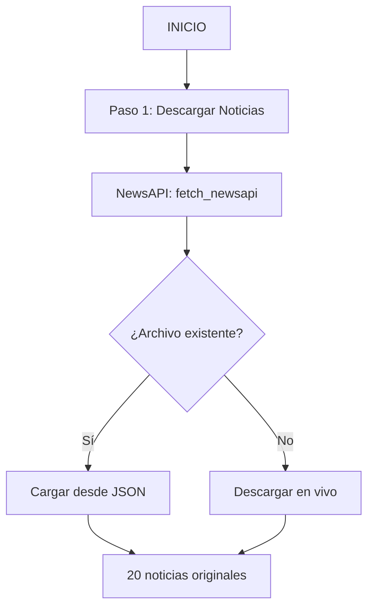
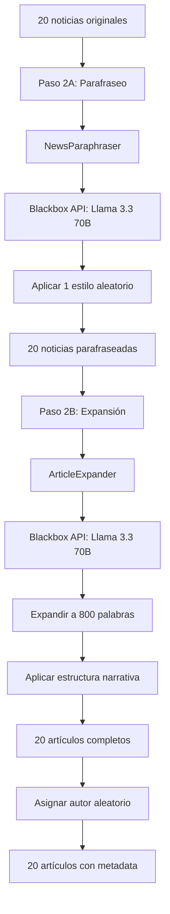
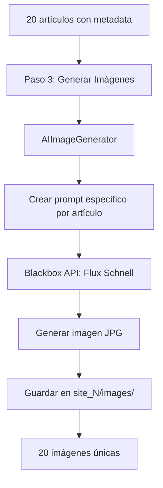
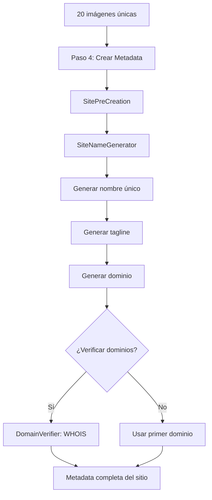
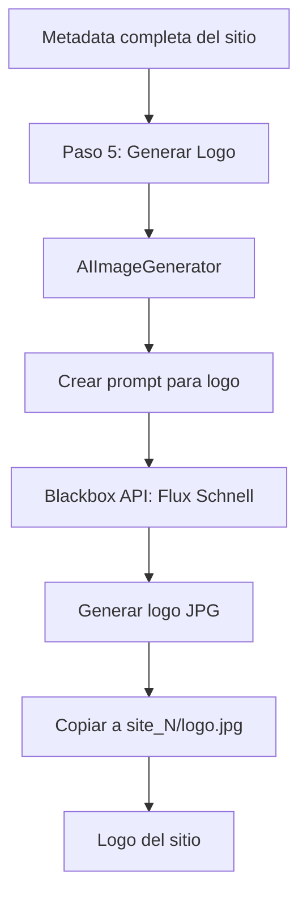
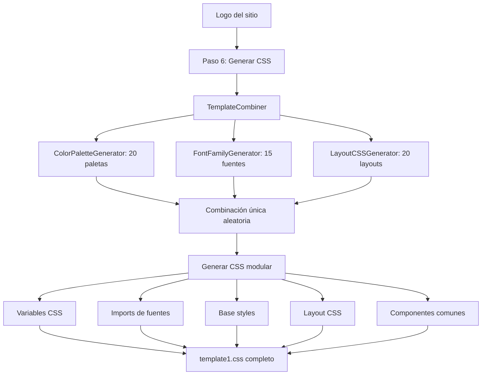
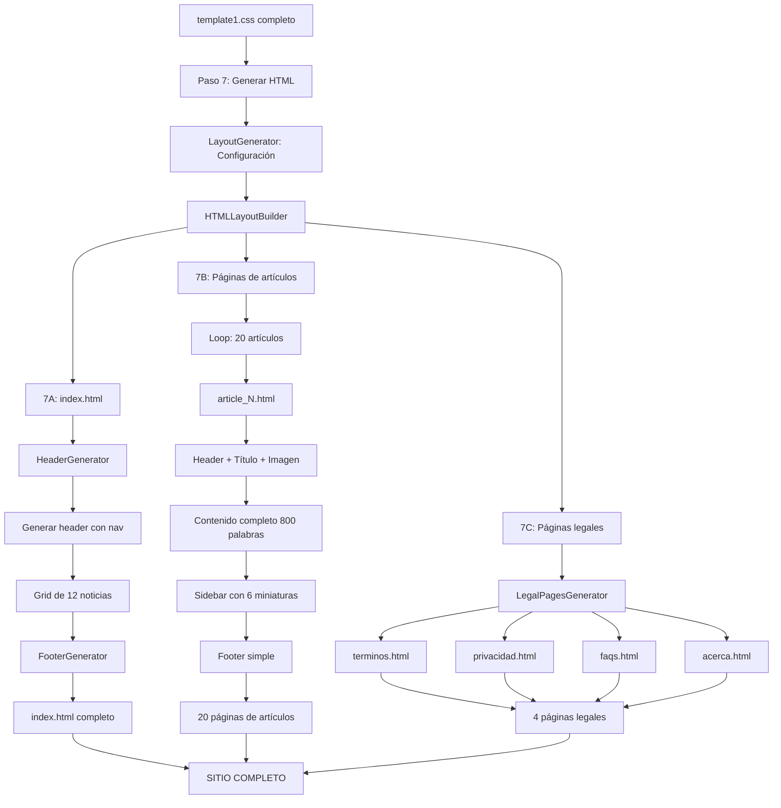

# 📊 DIAGRAMA DE FLUJO COMPLETO - News Prototype

## 🎯 Visión General del Sistema

```
NewsAPI → Parafraseo → Expansión → Imágenes AI → Metadata → Logos → CSS → HTML → Sitios
```

---

## 🔄 FLUJO DETALLADO PASO A PASO

### **FASE 1: OBTENCIÓN DE CONTENIDO**



**Módulos:**
- `scripts/api/newsapi.py`
- Función: `fetch_newsapi(query='tecnología', language='es', page_size=20)`

**Salida:**
- `data/noticias_newsapi_YYYYMMDD_HHMMSS.json`

---

### **FASE 2: TRANSFORMACIÓN DE CONTENIDO**



**Módulos:**
- `scripts/paraphrase.py` → `NewsParaphraser`
- `scripts/article-expander.py` → `ArticleExpander`
- `scripts/legal_pages_generator.py` → `generar_autor_aleatorio()`

**Estilos de parafraseo (8 disponibles):**
1. Profesional
2. Casual
3. Técnico
4. Académico
5. Narrativo
6. Crítico
7. Neutral
8. Optimista

**Estructuras narrativas (8 disponibles):**
1. Pirámide invertida clásica
2. Narrativa cronológica
3. Enfoque analítico
4. Contexto histórico
5. Impacto y consecuencias
6. Múltiples perspectivas
7. Datos y estadísticas
8. Testimonios y voces

**Salida:**
- `data/noticias_paraphrased_YYYYMMDD_HHMMSS.json`

---

### **FASE 3: GENERACIÓN DE IMÁGENES**



**Módulos:**
- `scripts/generate-images-ai.py` → `AIImageGenerator`
- Modelo: `flux-schnell` (Blackbox AI)

**Prompt pattern:**
```
Professional news image for technology article: [TITLE]
[DESCRIPTION]
Style: Modern, clean, tech-focused
Category: [CATEGORY]
High quality, photojournalistic
No text, no watermarks
```

**Salida:**
- `generated_sites/site_1/images/news_1.jpg` hasta `news_20.jpg`

---

### **FASE 4: CREACIÓN DE METADATA DEL SITIO**



**Módulos:**
- `scripts/site_pre_creation.py` → `SitePreCreation`
- `scripts/site_name_generator.py` → `SiteNameGenerator`
- `scripts/domain_verifier.py` → `DomainVerifier`

**Estilos de nombres (12 disponibles):**
1. profesional
2. moderno
3. dinámico
4. confiable
5. innovador
6. digital
7. nacional
8. global
9. regional
10. temático
11. abreviatura
12. compuesto

**Metadata generada:**
```json
{
  "nombre": "TechInfo Digital",
  "tagline": "Tu fuente confiable de tecnología",
  "dominio": "techinfodigital.com",
  "colores": {...},
  "categorias": [...],
  "contacto": {...},
  "redes_sociales": {...},
  "seo": {...}
}
```

**Salida:**
- `data/sites_metadata/sites_metadata_YYYYMMDD_HHMMSS.json`

---

### **FASE 5: GENERACIÓN DE LOGOS**



**Prompt pattern para logos:**
```
Professional minimalist logo for news website "[SITE_NAME]"
Tagline: [TAGLINE]
Style: Modern, clean, trustworthy, media company aesthetic
Simple icon or lettermark, tech-focused, credible news brand
Suitable for website header
Colors: professional blue, black or modern gradient
Vector style, flat design, high contrast
```

**Salida:**
- `generated_sites/site_1/logo.jpg`

---

### **FASE 6: GENERACIÓN DE TEMPLATES CSS**



**Módulos:**
- `scripts/template_combiner.py` → `TemplateCombiner`
- `scripts/color_palette_generator.py` → 20 paletas
- `scripts/font_family_generator.py` → 15 combinaciones
- `scripts/layout_css_generator.py` → 20 layouts estructurales

**Combinaciones posibles:**
```
20 paletas × 15 fuentes × 20 layouts = 6,000 combinaciones únicas
```

**CSS Structure:**
1. **Font Imports** - Google Fonts
2. **CSS Variables** (`:root`)
   - Colores (primary, secondary, accent, background, text)
   - Fuentes (primary, secondary, weights)
   - Spacing scale (xs, sm, md, lg, xl, 2xl, 3xl)
   - Breakpoints (sm: 640px, md: 768px, lg: 1024px, xl: 1280px, 2xl: 1536px)
   - Border radius (sm, md, lg, xl)
   - Shadows (sm, md, lg, xl)
3. **Base Styles** - Reset, body, typography, links
4. **Layout Structure** - Container, grid, flexbox
5. **Common Components** - Header, nav, footer, cards, sidebar, article pages, legal pages

**Salida:**
- `templates/css/template1.css`

---

### **FASE 7: GENERACIÓN DE SITIOS HTML**



**Módulos:**
- `scripts/layout_generator.py` → `LayoutGenerator`, `HTMLLayoutBuilder`
- `scripts/header_generator.py` → `HeaderGenerator`
- `scripts/footer_generator.py` → `FooterGenerator`
- `scripts/legal_pages_generator.py` → `LegalPagesGenerator`

**Configuración de Layout (generada aleatoriamente):**
```python
{
    "layout_type": "modern_cards",      # 20 tipos disponibles
    "sidebar_position": "right",        # left, right, none
    "header_style": "centered",         # 12 estilos
    "nav_style": "horizontal",          # 12 estilos
    "featured_layout": "hero_full",     # 15 layouts
    "news_per_row": 3,                  # 1, 2, 3, 4
    "footer_columns": 3,                # 2, 3, 4
    "footer_include_social": true,
    "sticky_header": false
}
```

**Estructura HTML generada:**

**index.html:**
```html
<!DOCTYPE html>
<html lang="es">
<head>
    <meta charset="UTF-8">
    <meta name="viewport" content="width=device-width, initial-scale=1.0">
    <title>TechInfo Digital - Tu fuente confiable de tecnología</title>
    <link rel="stylesheet" href="style.css">
    <meta name="description" content="...">
</head>
<body>
    <header class="header">
        <div class="container">
            <div class="header-branding">
                
                <h1 class="logo"><a href="index.html">TechInfo Digital</a></h1>
            </div>
            <nav class="nav">
                <a href="#inicio" class="nav-link">Inicio</a>
                <a href="#tecnologia" class="nav-link">Tecnología</a>
                <!-- ... más categorías ... -->
            </nav>
        </div>
    </header>
    
    <main class="main">
        <div class="container">
            <section class="news-section">
                <div class="news-grid cols-3">
                    <!-- 12 news cards -->
                    <article class="news-card">
                        <div class="card-image-wrapper">
                            
                            <span class="card-category-badge">Tecnología</span>
                        </div>
                        <div class="card-content">
                            <h3 class="card-title">
                                <a href="article_1.html">Título del artículo</a>
                            </h3>
                            <p class="card-text">Descripción...</p>
                            <div class="card-footer">
                                <span class="author">Ana García López</span>
                                <span class="date">2026-01-15</span>
                            </div>
                        </div>
                    </article>
                    <!-- Repetir 11 veces más -->
                </div>
            </section>
        </div>
    </main>
    
    <footer class="footer">
        <div class="container">
            <div class="footer-grid cols-3">
                <div class="footer-column">
                    <h3>TechInfo Digital</h3>
                    <p class="footer-about">Tu fuente confiable de tecnología</p>
                </div>
                <div class="footer-column">
                    <h4>Secciones</h4>
                    <ul class="footer-links">
                        <li><a href="index.html">Inicio</a></li>
                        <li><a href="#tecnologia">Tecnología</a></li>
                    </ul>
                </div>
                <div class="footer-column">
                    <h4>Legal</h4>
                    <ul class="footer-links">
                        <li><a href="terminos.html">Términos y Condiciones</a></li>
                        <li><a href="privacidad.html">Política de Privacidad</a></li>
                        <li><a href="faqs.html">Preguntas Frecuentes</a></li>
                        <li><a href="acerca.html">Acerca de Nosotros</a></li>
                    </ul>
                </div>
            </div>
            <div class="footer-bottom">
                <p>&copy; 2026 TechInfo Digital. Todos los derechos reservados.</p>
            </div>
        </div>
    </footer>
</body>
</html>
```

**article_N.html:**
```html
<!DOCTYPE html>
<html lang="es">
<head>
    <meta charset="UTF-8">
    <title>Título del Artículo - TechInfo Digital</title>
    <link rel="stylesheet" href="style.css">
</head>
<body>
    <header class="header">
        <!-- Header simple con logo y link a inicio -->
    </header>
    
    <main class="article-page">
        <div class="container">
            <div class="article-layout">
                <!-- Grid 2 columnas: artículo + sidebar -->
                
                <article class="article-full">
                    <header class="article-header">
                        <div class="article-category-badge">Tecnología</div>
                        <h1 class="article-title">Título completo del artículo</h1>
                        <div class="article-meta">
                            <span class="author">Por Ana García López</span>
                            <span class="separator">•</span>
                            <time class="date">15 de enero de 2026</time>
                        </div>
                    </header>
                    
                    <figure class="article-image-wrapper">
                        
                    </figure>
                    
                    <div class="article-content">
                        <p class="lead">Primer párrafo destacado con introducción...</p>
                        <p>Segundo párrafo con desarrollo...</p>
                        <p>Tercer párrafo con más contexto...</p>
                        <!-- ... más párrafos hasta completar 800 palabras ... -->
                    </div>
                    
                    <footer class="article-footer">
                        <div class="article-tags">
                            <span class="tag">Tecnología</span>
                        </div>
                        <div class="article-share">
                            <span>Compartir:</span>
                            <a href="#" class="share-link">Facebook</a>
                            <a href="#" class="share-link">Twitter</a>
                            <a href="#" class="share-link">WhatsApp</a>
                        </div>
                    </footer>
                </article>
                
                <aside class="article-sidebar">
                    <div class="sidebar-section">
                        <h2 class="sidebar-title">Más Noticias</h2>
                        <div class="sidebar-articles">
                            <!-- 6 miniaturas de otros artículos con imagen y título -->
                            <article class="sidebar-article">
                                <a href="article_2.html" class="sidebar-article-link">
                                    <div class="sidebar-article-image">
                                        
                                        <span class="sidebar-category">Tech</span>
                                    </div>
                                    <div class="sidebar-article-content">
                                        <h3 class="sidebar-article-title">Título breve...</h3>
                                        <span class="sidebar-article-date">2026-01-15</span>
                                    </div>
                                </a>
                            </article>
                            <!-- Repetir 5 veces más -->
                        </div>
                    </div>
                    
                    <div class="sidebar-section sidebar-newsletter">
                        <h3>Suscríbete</h3>
                        <p>Recibe las últimas noticias en tu correo</p>
                        <form class="newsletter-form">
                            <input type="email" placeholder="Tu email" required>
                            <button type="submit">Suscribirse</button>
                        </form>
                    </div>
                </aside>
            </div>
        </div>
    </main>
    
    <footer class="footer">
        <!-- Footer simple -->
    </footer>
</body>
</html>
```

**Páginas legales:**
- `terminos.html` - Términos y Condiciones completos (10 secciones)
- `privacidad.html` - Política de Privacidad GDPR-compliant (8 secciones)
- `faqs.html` - 10 preguntas frecuentes con respuestas
- `acerca.html` - Acerca de Nosotros (misión, valores, equipo)

**Salida:**
- `generated_sites/site_1/index.html`
- `generated_sites/site_1/article_1.html` hasta `article_20.html`
- `generated_sites/site_1/terminos.html`
- `generated_sites/site_1/privacidad.html`
- `generated_sites/site_1/faqs.html`
- `generated_sites/site_1/acerca.html`
- `generated_sites/site_1/style.css` (copiado desde templates)
- `generated_sites/site_1/logo.jpg`
- `generated_sites/site_1/images/news_1.jpg` hasta `news_20.jpg`

---

## 📁 ESTRUCTURA FINAL DEL SITIO GENERADO

```
generated_sites/
└── site_1/
    ├── index.html              # Página principal con 12 noticias
    ├── article_1.html          # Artículo 1 completo (800 palabras)
    ├── article_2.html          # Artículo 2 completo
    ├── ...
    ├── article_20.html         # Artículo 20 completo
    ├── terminos.html           # Términos y Condiciones
    ├── privacidad.html         # Política de Privacidad
    ├── faqs.html               # Preguntas Frecuentes
    ├── acerca.html             # Acerca de Nosotros
    ├── style.css               # CSS completo modular
    ├── logo.jpg                # Logo generado con AI
    └── images/
        ├── news_1.jpg          # Imagen artículo 1
        ├── news_2.jpg          # Imagen artículo 2
        ├── ...
        └── news_20.jpg         # Imagen artículo 20

Total archivos por sitio: 27 archivos
```

---

## 🔢 ESTADÍSTICAS DEL SISTEMA

### **Variabilidad del Sistema**

| Componente | Opciones | Descripción |
|-----------|----------|-------------|
| **Paletas de colores** | 20 | ColorPaletteGenerator |
| **Combinaciones de fuentes** | 15 | FontFamilyGenerator |
| **Layouts CSS estructurales** | 20 | LayoutCSSGenerator |
| **Tipos de layout HTML** | 20 | LayoutGenerator.LAYOUT_TYPES |
| **Estilos de header** | 12 | LayoutGenerator.HEADER_STYLES |
| **Estilos de navegación** | 12 | LayoutGenerator.NAV_STYLES |
| **Layouts destacados** | 15 | LayoutGenerator.FEATURED_LAYOUTS |
| **Estilos de nombre de sitio** | 12 | SiteNameGenerator |
| **Estilos de parafraseo** | 8 | NewsParaphraser |
| **Estructuras narrativas** | 8 | ArticleExpander |
| **Autores ficticios** | 20 | LegalPagesGenerator |

### **Combinaciones Totales Posibles**

```
CSS Templates: 20 × 15 × 20 = 6,000 combinaciones
HTML Layouts: 20 × 12 × 12 × 15 = 43,200 configuraciones
Contenido: 8 × 8 = 64 variaciones por artículo

Total combinaciones únicas de sitios: ~16.5 millones
```

### **Tiempo de Ejecución (estimado)**

| Paso | Duración | Descripción |
|------|----------|-------------|
| 1. Descargar noticias | 5-10s | NewsAPI |
| 2. Parafraseo + Expansión | 30-60s | 20 artículos × 1.5s-3s cada uno |
| 3. Generar imágenes | 40-80s | 20 imágenes × 2s-4s cada una |
| 4. Metadata del sitio | 2-5s | Con verificación de dominios |
| 5. Generar logo | 3-5s | 1 logo |
| 6. Generar CSS | 1-2s | Combinación modular |
| 7. Generar HTML | 2-5s | 25 páginas HTML |
| **TOTAL** | **~2-3 minutos** | Por sitio completo |

### **Consumo de API**

| API | Calls por sitio | Tokens aproximados |
|-----|-----------------|-------------------|
| **NewsAPI** | 1 | N/A (REST) |
| **Blackbox AI (Parafraseo)** | 20 | ~40,000 tokens |
| **Blackbox AI (Expansión)** | 20 | ~80,000 tokens |
| **Blackbox AI (Imágenes)** | 21 | N/A (generación) |
| **WHOIS (opcional)** | 1-5 | N/A |
| **TOTAL** | 62-66 | ~120,000 tokens |

---

## 🚀 COMANDO DE EJECUCIÓN

### **Uso básico**

```bash
# Generar 1 sitio sin verificar dominios (rápido)
python scripts/master_orchestrator.py

# Generar 1 sitio verificando dominios (lento)
python scripts/master_orchestrator.py --verificar-dominios

# Usar noticias en cache (no descargar nuevas)
python scripts/master_orchestrator.py --usar-cache
```

### **Parámetros disponibles**

```bash
--verificar-dominios    # Verificar disponibilidad de dominios con WHOIS
--output-dir PATH       # Directorio de salida personalizado
--usar-cache            # Usar noticias guardadas en lugar de descargar
```

---

## 🎨 CARACTERÍSTICAS DE DISEÑO

### **Sistema de Variables CSS Moderno**

Basado en **Tailwind CSS** y **CSS-Tricks best practices**:

```css
:root {
    /* Colores */
    --primary-color: #2C3E50;
    --secondary-color: #3498DB;
    --accent-color: #E74C3C;
    
    /* Spacing Scale */
    --space-xs: 0.25rem;    /* 4px */
    --space-sm: 0.5rem;     /* 8px */
    --space-md: 1rem;       /* 16px */
    --space-lg: 1.5rem;     /* 24px */
    --space-xl: 2rem;       /* 32px */
    --space-2xl: 3rem;      /* 48px */
    --space-3xl: 4rem;      /* 64px */
    
    /* Breakpoints */
    --breakpoint-sm: 640px;
    --breakpoint-md: 768px;
    --breakpoint-lg: 1024px;
    --breakpoint-xl: 1280px;
    --breakpoint-2xl: 1536px;
    
    /* Border Radius */
    --radius-sm: 0.25rem;
    --radius-md: 0.5rem;
    --radius-lg: 0.75rem;
    --radius-xl: 1rem;
    
    /* Shadows */
    --shadow-sm: 0 1px 2px 0 rgba(0, 0, 0, 0.05);
    --shadow-md: 0 4px 6px -1px rgba(0, 0, 0, 0.1);
    --shadow-lg: 0 10px 15px -3px rgba(0, 0, 0, 0.1);
    --shadow-xl: 0 20px 25px -5px rgba(0, 0, 0, 0.1);
}
```

### **CSS Grid Responsivo Moderno**

```css
.news-grid {
    display: grid;
    grid-template-columns: repeat(auto-fit, minmax(min(100%, 250px), 1fr));
    gap: clamp(1rem, 3vw, 2rem);
}

.footer-grid.cols-3 {
    grid-template-columns: repeat(auto-fit, minmax(min(100%, 250px), 1fr));
}
```

### **Tipografía Fluida**

```css
font-size: clamp(1.1rem, 2vw, 1.3rem);
```

### **Mobile-First Breakpoints**

```css
/* Base: Mobile */
@media (max-width: 640px) { ... }

/* Tablet */
@media (min-width: 641px) and (max-width: 1024px) { ... }

/* Desktop */
@media (min-width: 1025px) { ... }
```

---

## 🔐 SEGURIDAD Y PRIVACIDAD

### **Variables de Entorno Requeridas**

```bash
# .env
BLACKBOX_API_KEY=your_api_key_here
NEWS_API_KEY=your_newsapi_key_here  # Opcional si usas cache
```

### **Páginas Legales Incluidas**

✅ Términos y Condiciones completos  
✅ Política de Privacidad GDPR-compliant  
✅ FAQs con 10 preguntas frecuentes  
✅ Acerca de Nosotros con misión y valores  

### **Autores Ficticios**

20 nombres de autores generados aleatoriamente para cada artículo, evitando usar fuentes originales.

---

## 📊 RESUMEN EJECUTIVO

| Métrica | Valor |
|---------|-------|
| **Noticias procesadas** | 20 |
| **Artículos completos generados** | 20 (800 palabras cada uno) |
| **Imágenes AI generadas** | 21 (20 noticias + 1 logo) |
| **Páginas HTML generadas** | 25 (1 index + 20 artículos + 4 legales) |
| **Tiempo total** | ~2-3 minutos |
| **Combinaciones únicas posibles** | 16.5 millones |
| **CSS Variables** | 28 (colores, spacing, breakpoints, shadows) |
| **Responsive breakpoints** | 5 (sm, md, lg, xl, 2xl) |
| **APIs utilizadas** | 3 (NewsAPI, Blackbox AI Text, Blackbox AI Images) |

---

## ✅ VERIFICACIÓN DEL FLUJO

### **Checklist de Módulos Integrados**

- [x] **NewsAPI** - Descarga de noticias
- [x] **NewsParaphraser** - Parafraseo de contenido
- [x] **ArticleExpander** - Expansión a 800 palabras
- [x] **AIImageGenerator** - Generación de imágenes AI
- [x] **SiteNameGenerator** - Nombres y taglines únicos
- [x] **DomainVerifier** - Verificación WHOIS (opcional)
- [x] **SitePreCreation** - Metadata completa del sitio
- [x] **ColorPaletteGenerator** - 20 paletas de colores
- [x] **FontFamilyGenerator** - 15 combinaciones de fuentes
- [x] **LayoutCSSGenerator** - 20 layouts estructurales
- [x] **TemplateCombiner** - Combinación modular de CSS
- [x] **LayoutGenerator** - Configuración de layouts HTML
- [x] **HeaderGenerator** - Generación de headers
- [x] **FooterGenerator** - Generación de footers
- [x] **HTMLLayoutBuilder** - Construcción de HTML completo
- [x] **LegalPagesGenerator** - Páginas legales y autores

### **Checklist de Archivos Generados**

- [x] `index.html` - Página principal
- [x] `article_1.html` ... `article_20.html` - Páginas de artículos
- [x] `terminos.html` - Términos y Condiciones
- [x] `privacidad.html` - Política de Privacidad
- [x] `faqs.html` - Preguntas Frecuentes
- [x] `acerca.html` - Acerca de Nosotros
- [x] `style.css` - CSS completo modular
- [x] `logo.jpg` - Logo generado con AI
- [x] `images/news_1.jpg` ... `images/news_20.jpg` - Imágenes de noticias

### **Checklist de Features CSS**

- [x] Sistema de variables moderno (28 variables)
- [x] CSS Grid responsivo con auto-fit
- [x] Tipografía fluida con clamp()
- [x] Mobile-first breakpoints (5 niveles)
- [x] Spacing scale (7 niveles)
- [x] Border radius (4 niveles)
- [x] Box shadows (4 niveles)
- [x] Header flexible con flexbox
- [x] Footer grid responsivo
- [x] Cards con aspect-ratio
- [x] Sidebar pegajoso en artículos
- [x] Focus states y accesibilidad
- [x] Transiciones suaves
- [x] Hover effects

---

## 🎯 PRÓXIMOS PASOS (Mejoras Futuras)

1. **Deploy automático** - Vercel/Netlify integration
2. **SEO avanzado** - Sitemap, robots.txt, meta tags dinámicos
3. **Analytics** - Google Analytics integration
4. **RSS Feed** - Generación automática de feeds
5. **AMP Pages** - Versiones AMP de artículos
6. **PWA** - Service worker y manifest.json
7. **i18n** - Soporte multiidioma
8. **CMS Integration** - Panel de administración
9. **A/B Testing** - Variantes de diseño
10. **Performance** - Optimización de imágenes, lazy loading

---

**Última actualización:** 2026-01-15 14:30  
**Versión:** 2.0  
**Autor:** Sistema de Generación Automática de Sitios de Noticias
